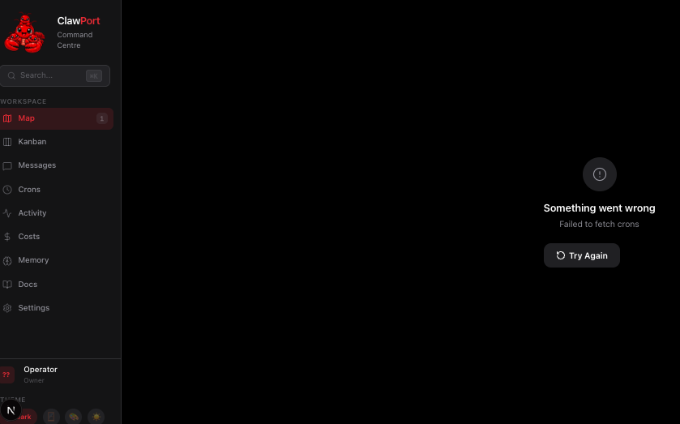

# ClawPort 中文版

<p align="center">
  
</p>

<p align="center">
  <strong>你的 AI 智能体团队的可视化指挥中心</strong>
</p>

<p align="center">
  <a href="https://www.npmjs.com/package/clawport-ui">
    
  </a>
  <a href="LICENSE">
    
  </a>
</p>

---

ClawPort 是一个开源的 AI 智能体管理控制台，用于管理、监控和直接与你本地的 [OpenClaw](https://openclaw.ai) AI 智能体团队进行对话。它连接到你本地的 OpenClaw 网关，提供组织架构图、直接对话（支持视觉、语音、文件附件）、看板、任务调度监控、成本追踪、活动控制台（实时日志流）和记忆浏览器等功能 —— 一切尽在掌握。

无需单独的 AI API 密钥，所有请求都通过你的 OpenClaw 网关路由。


<details>
<summary><strong>更多截图</strong></summary>

| | |
|---|---|
|  |  |
| **智能体对话** -- 流式文本回复、视觉理解、语音交互、文件附件 | **任务看板** -- 拖拽式任务管理，跨智能体分配工作 |
|  |  |
| **流水线** -- 可视化 DAG 流程图，集成健康检查 | **调度计划** -- 周热力图，任务管理 |
|  |  |
| **活动日志** -- 历史日志浏览器，支持 JSON 展开查看 | **实时日志** -- 流式日志组件，实时推送 |
|  |  |
| **成本分析** -- Token 消耗统计、异常检测、优化建议 | **记忆管理** -- 团队记忆浏览器，支持 Markdown |

</details>

---

## 快速开始

### 1. 安装 OpenClaw

ClawPort 需要运行中的 [OpenClaw](https://openclaw.ai) 实例。如果你还没有：

```bash
pip install openclaw
openclaw init
openclaw gateway run
```

### 2. 安装 ClawPort

```bash
# 克隆仓库
git clone https://github.com/kingwu791112/openclawport-cn.git
cd openclawport-cn

# 安装依赖
npm install

# 启动开发服务器
npm run dev
```

### 3. 访问 ClawPort

打开浏览器访问 http://localhost:3000

首次启动时，引导向导会帮助你配置：

- **系统检查** - 验证 OpenClaw 网关连接
- **工作空间设置** - 配置你的指挥中心名称
- **主题选择** - 选择浅色/深色主题
- **强调色** - 选择你喜欢的强调色
- **语音输入** - 启用系统语音识别

---

## 功能特性

### 🗺️ 组织架构图
以可视化的树状图展示智能体之间的汇报关系。

### 💬 智能体对话
- 流式文本响应
- 视觉理解（上传图片）
- 语音输入输出
- 文件附件支持

### 📋 看板
拖拽式任务管理，在不同智能体之间分配任务。

### ⏰ 定时任务
- DAG 流水线可视化
- 健康检查状态
- 周热力图计划
- 投递状态追踪

### 📊 成本追踪
- Token 使用量统计
- 异常检测
- 优化建议

### 📝 活动日志
- 历史日志浏览器
- JSON 展开查看
- 实时日志流

### 🧠 记忆管理
团队长期记忆和每日记录管理。

---

## 配置

### 环境变量

在项目根目录创建 `.env.local` 文件：

```bash
# OpenClaw 网关地址
OPENCLAW_URL=http://localhost:8000

# 可选：自定义端口
PORT=3000
```

### 智能体配置

在 `openclaw workspace` 目录下创建或编辑 `agents.json`：

```json
[
  {
    "id": "agent-1",
    "name": "助手",
    "description": "主要助手智能体",
    "reportsTo": null
  }
]
```

---

## 技术栈

- **前端**: Next.js 16, React, TypeScript
- **样式**: CSS Variables, Lucide Icons
- **状态**: React Context, LocalStorage

---

## 许可证

MIT License - 查看 [LICENSE](LICENSE) 文件

---

## 相关链接

- [OpenClaw](https://openclaw.ai)
- [ClawPort 官网](https://clawport.dev)
- [npm 包](https://www.npmjs.com/package/clawport-ui)

---

## 联系我

如有问题，欢迎扫码添加微信咨询：


